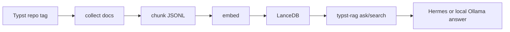

# TypstRAG demo

TypstRAG is a local documentation RAG for Typst. It clones Typst docs, chunks them, embeds them into LanceDB, and answers with source paths.



## Run

```bash
git clone https://github.com/berlogabob/TypstRAG.git
cd TypstRAG
uv sync
uv run typst-rag build-all
uv run typst-rag doctor
uv run python scripts/smoke.py
uv run typst-rag ask "how to make a two-column academic paper?" --limit 5
```

## What this proves

- The index is reproducible from a pinned Typst tag.
- Answers cite Typst source paths and URLs.
- The same retrieval can feed Hermes, local Ollama, or manual web-chat paste.
- No hosted backend is required for sharing the project.

## Example artifact

See [`examples/academic-paper/main.typ`](../examples/academic-paper/main.typ). It demonstrates title/authors, abstract, two-column body text, a figure, citation, and bibliography.

Compile it:

```bash
typst compile examples/academic-paper/main.typ examples/academic-paper/main.pdf
```

Sources used for the example are listed in [`RAG-SOURCES.md`](RAG-SOURCES.md).
